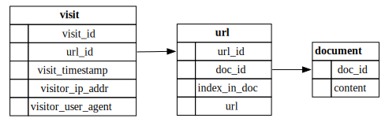

# Linkletter - URL replacement and analytics service

Linkletter is a demo web service for replacing URLs in documents with
other managed URLs, which when visited collect information for analytics purposes
before redirecting to the original resource.

## Usage

To start the Linkletter server, simply execute the [installed binary](#Installation):

```
$ LL_RUN_MODE=<desired run mode> LL_CONFIG_DIR=<path to config directory> linkletter
```

If defined, `LL_CONFIG_DIR` should point to a directory containing a `settings.json`
with settings as [described below](#Configuration), and optionally a `settings.<LL_RUN_MODE>.json`
containing settings to override based on the value of `LL_RUN_MODE`.

If not given, `LL_RUN_MODE` defaults to `dev` and `LL_CONFIG_DIR` defaults to `./config`.

### Endpoints

When running, Linkletter exposes a REST API with the following endpoints:
- `POST /documents`:
  Replaces URLs in message body with managed URLs.
  Returns JSON object with format:
  ```json
  {
      "id": "<ID assigned to document>",
      "replacement": "<passed message body with URLs replaced>"
  }
  ```
- `GET /documents/<ID>/urls`:
  Gets URLs found in document with given ID, in order of appearance.
  Returns JSON list of objects with format:
  ```json
  {
      "id": "<ID assigned to URL>",
      "url": "<URL as it appears in the original document>"
  }
  ```
- `GET /documents/<ID>/visits`:
  Gets all visits of URLs found in document with given ID, in order of time of visit.
  Returns JSON list of objects with format:
  ```json
  {
      "id": "<ID assigned to URL>",
      "timestamp": "<date and time of visit in RFC 3339 format>",
      "ipAddr": "<connecting address of visitor>",
      "userAgent": "<value of `User-Agent` header in visit request>"
  }
  ```
- `GET /documents/<ID>/analytics`:
  Aggregates information of visits to URLs found in document with given ID.
  Returns JSON list of objects with format:
  ```json
  {
      "id": "<ID assigned to URL>",
      "visitCount": "<total number of visits to URL>",
      "firstVisit": "<date and time of first visit in RFC 3339 format, or null>",
      "latestVisit": "<date and time of latest visit in RFC 3339 format, or null>"
  }
  ```
- `GET /urls/<ID>`:
  Return original URL with given ID as plain text in message body.
- `GET /urls/<ID>/visits`:
  Gets all visits of URL with given ID, in order of time of visit.
  Returns JSON list of objects with format:
  ```json
  {
      "timestamp": "<date and time of visit in RFC 3339 format>",
      "ipAddr": "<connecting address of visitor>",
      "userAgent": "<value of `User-Agent` header in visit request>"
  }
  ```
- `/visit/<ID>`:
  Not meant to be called directly.
  Returns redirect to original URL with given ID.

### Configuration

Linkletter looks for configuration in `<LL_CONFIG_DIR>/settings.json`,
which should include the following:

```json
{
    "address": {
        "ip": "<IP address to bind server on>",
        "port": <port to bind server on>
    },
    "database": {
        "url": "<URL to SQLite database>",
        "migrations": "<path to directory containing scripts for schema migrations>"
    },
    "api": {
        "host_url": "<base URL for host which logs and redirects visits>"
    }
}
```

### Installation

This project is not currently available from any package repository.
To build from source using Cargo:

```
$ git clone https://github.com/mrbjarksen/linkletter
$ cd linkletter
$ cargo build --release
$ cp target/release/linkletter <desired location>
```

This repository also exposes a Nix flake:

```
$ nix build github:mrbjarksen/linkletter
$ cp result/bin/linkletter <desired location>
```

---

## Design overview

Linkletter is implemented as a single-process asynchronous web server using Rust and SQLite.
Various industry standard crates are used, such as:
- tokio as an async runtime,
- axum for HTTP routing and request-handling,
- sqlx for database communication via SQL.

### Application flow

Application flow is generally catagorized into three parts:
_replacement_, _visit handling_ and _analytics_.

#### Replacement

Upon receiving a request to replace URLs in a document,
Linkletter first generates a UUIDv7 for the document
before persisting the document content in the database for safekeeping.

Then the content is searched for URLs and each one found is assigned a UUIDv4 and
persisted in the database sequentially (keeping track of its position in the document),
before it is added to the replaced content being constructed.

This was chosen for ease of implementation.
Since Linkletter is an asynchronous service, this is not optimal,
as database inserts could be performed concurrently.

#### Visit handling

When a managed URL is visited by an end-user,
Linkletter fetches the original URL with ID embedded in replaced URL
and logs information such as the date and time of the visit,
connecting IP address of visitor and metadata found in the HTTP header.

This database operation is done in the background, concurrently
to the user being redirected to the original URL, such that the user
is not affected in case of failure.

The redirect is achieved using the HTTP status code 307 Temporary Redirect,
which avoids the client caching the resulting URL and bypassing Linkletter
on subsequent visits.

#### Analytics

The remaining analytics requests are all handled similarly:
by routing the request to an appropriate SQL query whose result is
processed and serialized into a response.

### Database schema

Below is a diagram describing the expected database schema for Linkletter.



### Document and URL IDs

Linkletter uses UUIDs for unique identifiers of both documents and URLs,
formatted as hexadecimal strings without hyphens.

In terms of performance, these IDs should ideally all be UUIDv7 (i.e. seeded by timestamp),
since they are used as database keys. This would improve performance of both read and write
queries, as keys would be less fragmented throughout the database.
For this reason, document IDs are always UUIDv7s.

Since URL IDs are exposed to end-users in the form of replaced URLs, however,
it is generally more safe for them to avoid UUIDv7.
Instead, Linkletter assigns UUIDv4s to URLs.
This reduces attack surface, by way of minimizing the likelihood
of being able to sniff out some ID for a URL intended for some other user.

## Considerations

Some aspects of Linkletter need further consideration
before the service can be applied in a production environment.

### Authentication

As it stands, Linkletter does not implement any form of authentication,
relying entirely on cryptographic randomness of generated IDs for security.
This may be fine in cases where the host service is completely isolated from external parties,
e.g. when used as an internal microservice.

If this is API should be more publicly available and be trusted to handle
potentially sensitive information, this should be the first addition made.

### Database engine

Among the first changes that should be made before using this service at scale is to
change database providers from SQLite to another relational database, e.g. PostgreSQL or MySQL.

SQLite was chosen for its flexibility and ease of use in small-to-medium sized applications,
but its limitations quickly become liabilities as soon as architecture needs to scale horizontally.
When this happens, some client/server SQL database engine should be used instead
(with appropriate load-balancing/caching/redundancy/partitioning based on needs).

This is especially true for Linkletter, since we should expect many concurrent writes
as users visit URLs through the service, which may quickly overwhelm the system due to file locks.

NoSQL databases are not recommended as a primary datastore as flexibility in data querying is important for analytics.
With that said, they may be useful as secondary datastores, e.g. using Redis as a caching layer.

If SQLite is opted to be used in production, WAL mode should at minimum be enabled to improve concurrent performance.

### Database size

A likely use case of Linkletter is to track visits of URL over some relatively short period of time.
In this case, some expiry age would be preferable to avoid disk usage ballooning over several years.
After data is deemed expired (e.g. based on creation time or last time visited)
it would then either be deleted or moved to some compacted archive.

Another method to reducing database size would be to move document content
to some object storage service (e.g. Amazon S3).
This is beneficial as document content is not currently used for any analytic needs.
Document content might further be stored by hash in cases where one document needs to be sent
to many users, with per-user analytics, for example in cases of email templates.

### GraphQL for analytics

The current analytic capabilities of Linkletter are functional, but somewhat half-baked.
If this service is intended to be used by potentially many parties with varied analytical needs,
an endpoint accepting GraphQL queries should be considered.

This would allow for much greater flexibility than the current REST API
(which does not even support filtering on timestamp).

### Schema migrations

Linkletter leverages `sqlx::migrations` for the management of schema changes.
On start-up, scripts found in `db/migrations` (relative to the working directory)
are automatically applied if they have not already.

This is convenient for quick iteration and version control, but care must be taken
to avoid applying scripts that could cause data loss or corruption.
If this is a concern, manual control of database changes may be more appropriate.

### Structured and event-driven logging

Currently, Linkletter only performs logging by printing errors to `stderr`.
This means logs are not persisted, which makes diagnostics difficult.
Therefore, some sort of logging framework should be introduced
before this service is used in any serious capacity, e.g. using the `log` crate.

Since Linkletter is asynchronous, and may potentially be used by many concurrent users,
a structured and event-driven logging framwork is appropriate. This allows to quickly search
through logs to follow errors to their source. The `tracing` crate is recommended.

---

## AI Notice

No generative AI has been used in any direct capacity at any part of the development of this project.
